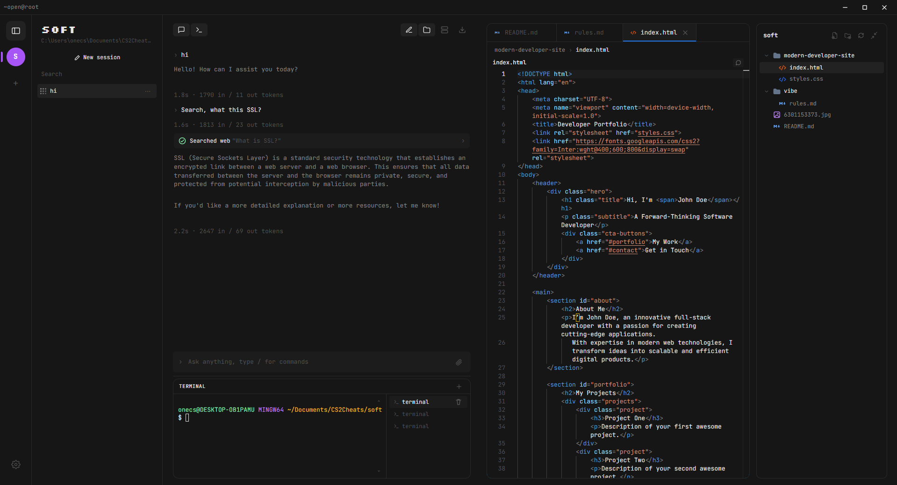

<div align="center">



# openvibe

**Open-source agentic coding IDE. Bring your own AI model.**

A free, desktop-native alternative to Cursor and Claude Code — works with any OpenAI-compatible model.

[Download](https://github.com/muradtedeev0912-maker/openvibe/releases) · [Website](https://openvibe-beta.vercel.app) · [Updates](https://openvibe-beta.vercel.app/updates.html)

</div>

---

## Quick Start

```bash
git clone https://github.com/muradtedeev0912-maker/openvibe.git
cd openvibe
npm install && npm run build && npm start
```

Then open Settings (⚙) and connect your AI provider — OpenAI, Anthropic, Groq, DeepSeek, Gemini, Ollama, or any OpenAI-compatible endpoint.

## Features

- 🤖 **Agentic AI** — reads, writes, edits files and runs commands autonomously
- 🔌 **Any model** — OpenAI, Claude, Gemini, Groq, DeepSeek, Ollama, OpenRouter, custom endpoints
- 🧩 **MCP Support** — connect external tools via Model Context Protocol (GitHub, databases, browsers)
- ⚡ **Monaco editor** — VS Code engine with file tabs, breadcrumbs, autosave, 230+ file icons
- 💻 **Integrated terminal** — real PowerShell/bash PTY with multiple tabs
- 📂 **Multi-project** — unlimited projects with isolated sessions
- 🔍 **Web search** — AI can search the internet for docs and current info
- 🎨 **Project templates** — scaffold React, Next.js, Express, Flask, Electron, Telegram Bot, Vue 3
- 📦 **Project snapshots** — one-click zip backup
- 📝 **Markdown + LaTeX** — full markdown rendering with KaTeX math
- 🎯 **`.vibe/` rules** — project-specific AI instructions in `.vibe/*.md` files
- 🔊 **Sound feedback** — audio notifications for AI actions
- 🎨 **Real-time editor** — see AI changes live as it codes
- 🆓 **Free & open source** — MIT license, no telemetry, no accounts

## Comparison

| Feature | openvibe | Cursor | Claude Code |
|---------|----------|--------|-------------|
| **Open source** | ✅ MIT | ❌ | ❌ |
| **Free** | ✅ | $20/mo | $20/mo |
| **Bring your own model** | ✅ Any | ⚠️ Limited | ❌ Claude only |
| **Local models (Ollama)** | ✅ | ⚠️ | ❌ |
| **MCP support** | ✅ | ✅ | ✅ |
| **Desktop app** | ✅ | ✅ | ❌ CLI only |
| **Integrated terminal** | ✅ | ✅ | ✅ |
| **Monaco editor** | ✅ | ✅ | ❌ |
| **Project templates** | ✅ | ❌ | ❌ |
| **Snapshots** | ✅ | ❌ | ❌ |
| **No vendor lock-in** | ✅ | ❌ | ❌ |
| **Telemetry** | ❌ None | ⚠️ Yes | ⚠️ Yes |
| **Account required** | ❌ | ✅ | ✅ |

## Models Supported

Any OpenAI-compatible API endpoint. Tested with:

- **OpenAI** — GPT-4o, GPT-4o-mini, o1
- **Anthropic** — Claude 3.5 Sonnet (via proxy)
- **Google** — Gemini 1.5 Pro/Flash
- **Groq** — Llama 3.3, Mixtral, fast inference
- **DeepSeek** — DeepSeek-V3, DeepSeek-R1
- **Ollama** — local Llama, Qwen, Mistral
- **LM Studio**, **vLLM**, **OpenRouter**, **GitHub Models** — all work

## Project Rules (`.vibe/`)

Drop a `.vibe/rules.md` in your project to teach the AI your conventions:

```markdown
# Project Rules

- Use TypeScript only, no JavaScript
- Use camelCase for variables, PascalCase for classes
- Always use async/await, never .then()
- Tailwind CSS for styles, no CSS-in-JS
```

The AI reads these rules at session start and follows them strictly.

## Build from Source

```bash
npm install
npm run build
npm start
```

For development with hot reload:
```bash
npm run dev
```

## Contributing

PRs welcome. Open an issue first for larger changes.

## License

MIT — use it for anything, personal or commercial.

---

<div align="center">

Built by [Murad](https://github.com/muradtedeev0912-maker) · 16 y.o. · Full-stack developer

</div>
